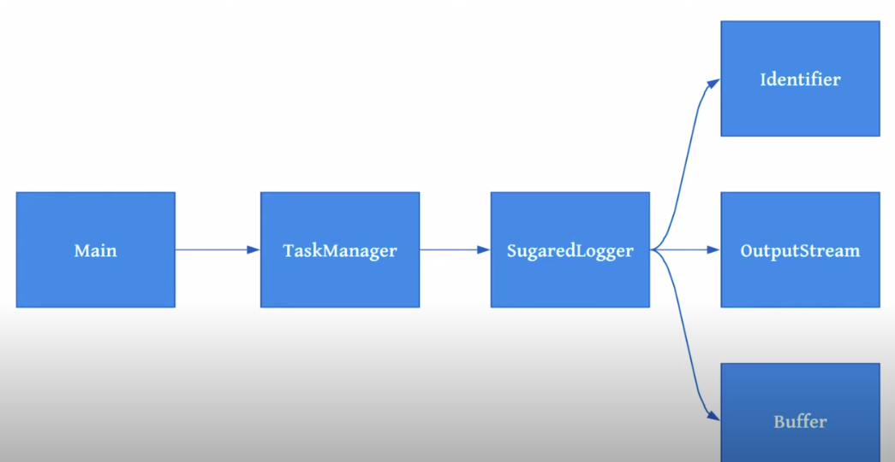
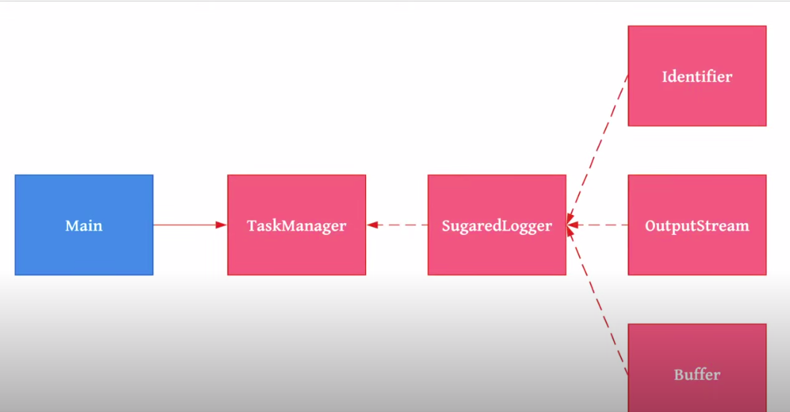
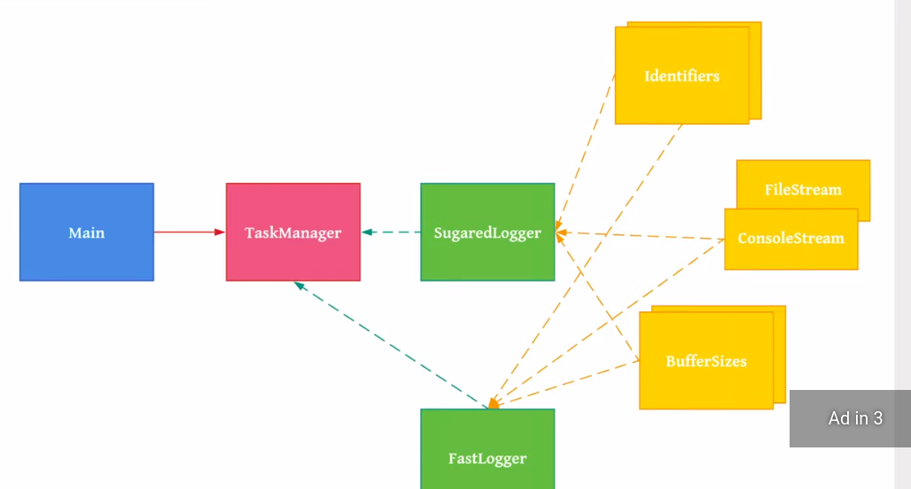

= Java Dependency Injection
:toc:

> [Repo forked from Gaurav's live stream](https://www.youtube.com/watch?v=7Xomxjc8jzw)


> Gaurav Sen's Live stream on DI in Java


== Design Patterns

1. Singleton
2. Factory
3. DI

== Implementing Slow/Sugared Logger




=== Why it is slow?

1. `public static synchronized  SlowLogger getLogger(OutputStream out)`
Need to remove custom singleton [static(cannot create object) & synchronized() ] pattern

2. 
```java
@Inject
public SlowLogger(OutputStream outputStream) {
  identifier = "stream: ";// hardcoded     
  buffer = new ArrayList<>();// make this flexible type
}
```

== Implementing Slow/Sugared Logger with `@Singleton` DI


== Fast logger




- YELLOW: Properties Module
- GREEN: Logging Module

=== Factory Pattern
You can configure File or Console output here:

`@Named("console-output-stream") final OutputStream stream, //@Named("console-output-stream")`

This factory method is defined in `LoggingModule`:

```java
@Provides // factory method
    @Named("file-output-stream")
    public OutputStream getOutputStream(@Named("output-file.name") String fileLocation) throws FileNotFoundException {
        return new FileOutputStream(fileLocation);
    }

@Provides // factory method
@Named("console-output-stream")
public OutputStream getConsoleOutputStream(@Named("output-file.name") String fileLocation) throws FileNotFoundException {
    return System.out;
}
```
